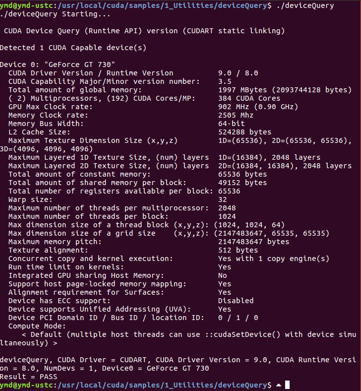

写在前面：
GPU并行计算和CUDA程序开发及优化 课堂笔记+课程作业
主要是一些小程序练手

<!--more-->

### GPU相关知识

#### GPU的计算模式
在**异构协同处理计算模型**中将CPU与GPU结合起来加以利用。应用程序的串行部分在CPU上运行，而计算任务繁重的部分则由GPU的高性能计算来进行。从用户的角度来看，应用程序只是运行得更快了，获得了很好的性能提升。

#### 高性能计算机的 分类
单指令流单数据流（ SISD）
• 单指令流多数据流（ SIMD）
• 多指令流单数据流（ MISD）
• 多指令流多数据流（ MIMD）

单独的高性能计算节点主要分为：
• 同构节点（仅采用CPU， Intel Xeon CPU、 AMD Opteron CPU）
• 异构节点（分为主机端和设备端，分别注重逻辑运算和浮点计算。

主流异构节点类型包括CPU+GPU和CPU+MIC
MIC： Many Integrated Core （Intel 集成众核）

### GPU硬件架构

#### NVIDIA不同架构产品
不同GPU架构的设计理念、工艺水平等均不相同，相应的内部体系结构和性能也不相同。每一构架都对应大量产品
- Tesla
- Fermi
- Kepler
- Maxwell
- Pascal
- Volta

#### GPU体系结构相关术语
- SP（ Streaming Processor） :流处理器是GPU运算的最基本计算单元。
- SFU（ Special Function Unit） :特殊函数单元用来执行超越函数指令，比如正弦、余弦、平方根等函数。
- Shader core（渲染核/着色器）， SP的另一个名称，又称为CUDA core，始于Fermi架构
- DP （双精度浮点运算单元）
- SM（ Streaming Multiprocessors） :流式多处理器是GPU架构中的基本计算单元，也是GPU性能的源泉，由 SP、DP、 SFU等运算单元组成。这是一个典型的阵列机，其执行方式为SIMT（单指令多线程），区别于传统的 SIMD（单指令流多数据流），能够保证多线程的同时执行
- SPA（ Scalable streaming Processor Array）可扩展的流处理器阵列：所有处理核心和高速缓存的总和，包含所有的SM、 TPC、 GPC。与存储器系统共同组成GPU构架
- MMC（ MeMory Controller）存储控制器：控制存储访问的单元，合并访存。每个存储控制器可以支持一定位宽的数据合并访存。
- ROP（ raster operation processors）光栅操作单元
- LD/ST（ Load/Store Unit）存储单元

deviceQuery

从图中可以看出，我的GPU为GT730，CUDA版本为9.0，GPU显存为2G，拥有384个CUDA核，GPU最大时钟频率为0.9Ghz，显存带宽为64位，每个block最多支持1024个线程。

与1080TI/k20相比，有些参数没差多少。

### Reference

[CSDN解读 RCAN Image Super-Resolution Using Very Deep Residual Channel Attention Networks-ECCV2018 ](https://blog.csdn.net/aaa958099161/article/details/82836846)

