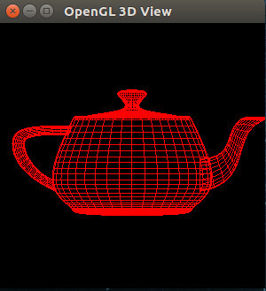

写在前面：
在linux下开发OpenGL。
简单介绍OpenGL并安装，编写第一个程序。

环境：Ubuntu 16.04 LTS
Graphics:GT 730
gcc 5.4.0

<!--more-->

### 什么是OpenGL

OpenGL 是一套由SGI公司发展出来的绘图函式库，它是一组 C 语言的函式，用于 2D 与 3D 图形应用程式的开发上。OpenGL 让程式开发人员不需要考虑到各种显示卡底层运作是否相同的问题，硬体由 OpenGL 核心去沟通，因此只要显示卡支援 OpenGL，那么程式就不需要重新再移植，而程式开发人员也不需要重新学习一组函式库来移植程式。

### 安装

1.首先安装编译器与基本函数库，一般情况下系统均已安装：
```
$ sudo apt-get install build-essential
```

2.其次安装 OpenGL Library
```
$ sudo apt-get install libgl1-mesa-dev
```

3.安装OpenGL Utilities
```
$ sudo apt-get install libglu1-mesa-dev
```

OpenGL Utilities 是一组建构于 OpenGL Library 之上的工具组，提供许多很方便的函式，使 OpenGL 更强大且更容易使用。

4.安装OpenGL Utility Toolkit
```
$ sudo apt-get install libglut-dev
```

OpenGL Utility Toolkit 是建立在 OpenGL Utilities 上面的工具箱，除了强化了 OpenGL Utilities 的不足之外，也增加了 OpenGL 对于视窗介面支援。
       
**注意：在这一步的时候，可能会出现以下情况，shell提示：**
```
Reading package lists... Done
Building dependency tree
Reading state information... Done
E: Unable to locate package libglut-dev
```
将上述`$ sudo apt-get install libglut-dev`命令改成`$ sudo apt-get install freeglut3-dev`即可。

### 第一个OpenGL程序

代码：
```
#include <GL/glut.h>

void init(void)
{
    glClearColor(0.0, 0.0, 0.0, 0.0);
    glMatrixMode(GL_PROJECTION);
    glOrtho(-5, 5, -5, 5, 5, 15);
    glMatrixMode(GL_MODELVIEW);
    gluLookAt(0, 0, 10, 0, 0, 0, 0, 1, 0);

    return;
}

void display(void)
{
    glClear(GL_COLOR_BUFFER_BIT);
    glColor3f(1.0, 0, 0);
    glutWireTeapot(3);
    glFlush();

    return;
}

int main(int argc, char *argv[])
{
    glutInit(&argc, argv);
    glutInitDisplayMode(GLUT_RGB | GLUT_SINGLE);
    glutInitWindowPosition(0, 0);
    glutInitWindowSize(300, 300);
    glutCreateWindow("OpenGL 3D View");
    init();
    glutDisplayFunc(display);
    glutMainLoop();

    return 0;
}
```

编译程序：
```
$  gcc -o test test.c -lGL -lGLU -lglut
```

执行：
```
$ ./test
```

结果：
<div align="center">

</div>


期间编译时报错：
```
test.c: In function ‘main’:
test.c:30:5: error: stray ‘\342’ in program
     glutCreateWindow(“OpenGL 3D View”);
     ^
test.c:30:5: error: stray ‘\200’ in program
test.c:30:5: error: stray ‘\234’ in program
test.c:30:32: error: invalid suffix "D" on integer constant
     glutCreateWindow(“OpenGL 3D View”);
                                ^
test.c:30:25: error: ‘OpenGL’ undeclared (first use in this function)
     glutCreateWindow(“OpenGL 3D View”);
                         ^
test.c:30:25: note: each undeclared identifier is reported only once for each function it appears in
test.c:30:32: error: expected ‘)’ before numeric constant
     glutCreateWindow(“OpenGL 3D View”);
                                ^
test.c:30:32: error: stray ‘\342’ in program
test.c:30:32: error: stray ‘\200’ in program
test.c:30:32: error: stray ‘\235’ in program
```

解决方法：把`glutCreateWindow("OpenGL 3D View");`中的中文`“”`换成英文`""`。
参考：[Stray '\342' in C++ program](https://stackoverflow.com/questions/2340930/stray-342-in-c-program)


### Reference
本文内容主要参考[Ubuntu 安装OpenGL](https://blog.csdn.net/zhangliang_571/article/details/25241911)
[Ubuntu14.04下配置OpenGL及测试代码](https://blog.csdn.net/fengbingchun/article/details/80150544)
