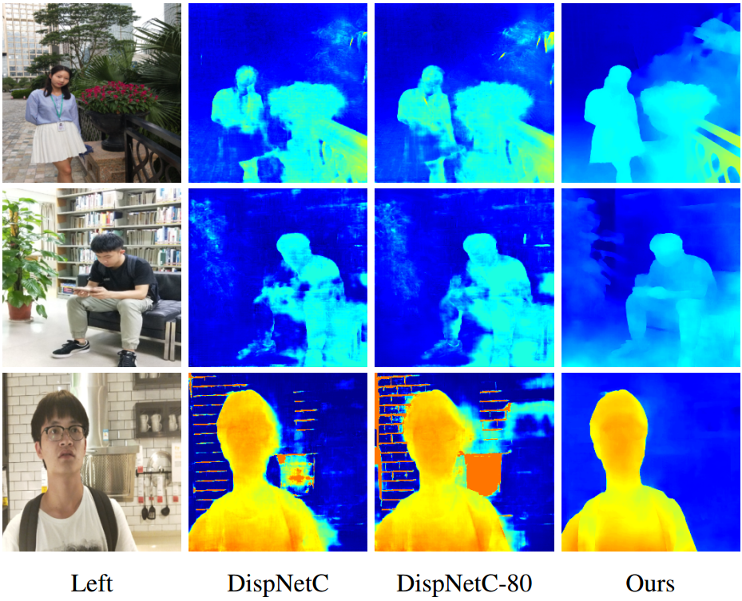
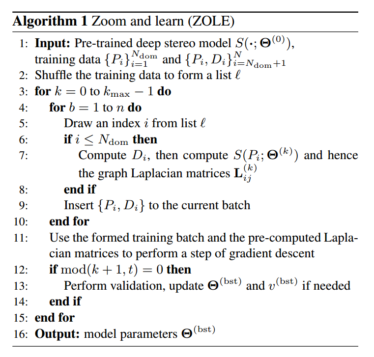
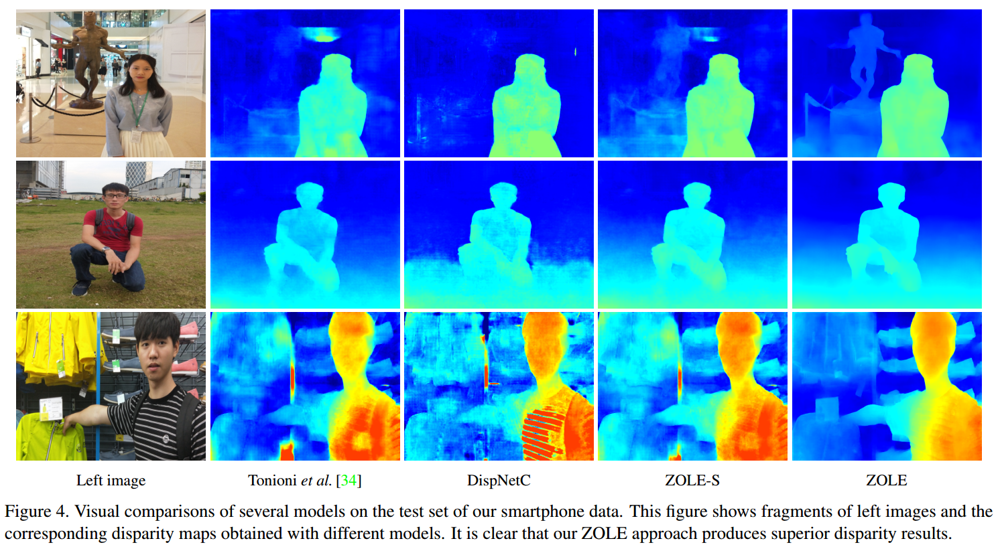
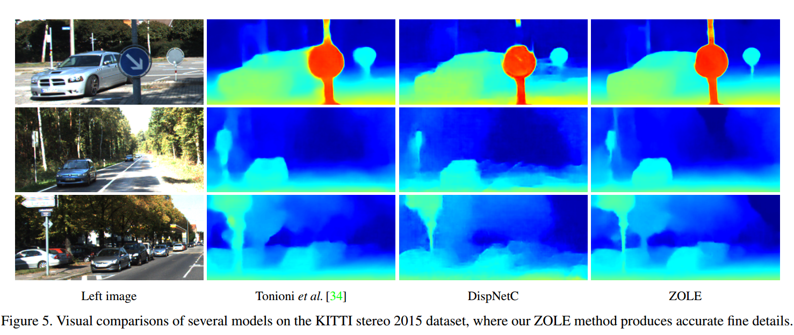

写在前面：CVPR2018，针对双目匹配在训练和实际应用中存在的domin transfer问题。
由于商业原因，作者只公布了测试代码。

题目：Zoom and Learn: Generalizing Deep Stereo Matching to Novel Domains
作者：Jiahao Pang$^1$ Wenxiu Sun$^1$ ChengxiYang$^1$ JimmyRen$^1$ RuichaoXiao$^1$ JinZeng$^1$ LiangLin$^{1,2}$
$^1$SenseTime Research $^2$Sun Yat-sen University

<!--more-->

### 背景
#### motivation
立体匹配通用难点：基于CNN的立体匹配的一个难点在于训练得到的立体匹配模型往往不能使用在真实场景(new domain)中，即两个domain之间存在gap(这也是CNN的一个通病)。

两个常识：
 - 预训练好的模型在新domain直接使用会在边界出现artifacts
 - 使用up-sampled的图像对生成disparity会带来额外的细节
 
基于这两个常识，作者使用迭代优化的方式在 让CNN得到高空间分辨率的输出(常识2) 的同时，利用graph Laplacian regularization保留边界且平滑边界的artifacts(常识1).

作者在手机拍摄的日常场景和KITTI上进行了实验验证。

#### other works
监督：

- DispNet,first end-to-end CNN stereo matching
- CRL:A two-stage convolutional neural network for stereo matching. (ICCVW2017)
- GC-NET:End-to-end learning of geometry and context for deep stereo regression.（ICCV2017）
- DRR:Detect, replace, refine: Deep structured prediction for pixel wise labeling.(CVPR2017)

半监督：

- Unsupervised monocular depth estimation with left-right consistency(CVPR2017)
- Semi-supervised deep learning for monocular depth map prediction.(CVPR2017)
- Self-supervised learning for stereo matching with self-improving ability.arXiv
-  Unsupervised learning of stereo matching.(ICCV2017)‘
 
目前常用方式，合成数据集上训练后再在有GT的目标数据上finetune.

- End-to-end learning of geometry and context for deep stereo regression.（ICCV2017）
- A large dataset to train convolutional networks for disparity, optical flow, and scene flow estimation.(CVPR2016)
- A two-stage convolutional neural network for stereo matching.(ICCVW2017)

Graph Laplacian regularization.
 - 这里引用集中在denosing方面，不看了。

Iterative regularization/filtering
- 引用为image restoration方面，作者将其引入到CNN。
- 作者还专门强调，不同于堆叠CNN，这里的iteration是在训练过程中的iteration.

### 主要内容
 
尺度多样性。

#### 算法

#### 评价指标
**定量评价**
这里的评价指标很有意思。由于作者在三个数据集上进行了验证，有一个是和训练集相同的FlyingThings3D-80,另外一个是没有GT的手机拍摄的数据集，还有KITTI2015。

EPE:End-point-End
3ER:three-pixel error rate
这里所谓的PSNR和SSIM是利用disparity和右图生成的左图与真正的左图计算的PSNR和SSIM。左右图warp后肯定会有occlusion的存在，不知道这么PSNR意义是否很大。

**视觉指标**

 

### 总结

总结起来，使用了graph Laplacian 保持物体的边界，具体方法迭代patch。大概就这样。
与另一篇相似的工作Unsupervised Adaptation for Deep Stereo相比，指标高了那么一diudiu。

### 相关工作
Unsupervised Adaptation for Deep Stereo
代码：[tensorflow版本](https://github.com/AlessioTonioni/dispflownet-tf)、[caffe版本](https://github.com/CVLAB-Unibo/Unsupervised-Adaptation-for-Deep-Stereo)

文章有何贡献：本文提出了一种新的 fine-tuning 的方法使在大量合成数据上训练的 DispNet 可以迁移到无 groudtruth 或者只有极少量的 groundtruth 的实际数据集上。

本文研究的问题有何价值：双目深度估计的标签现实中很难获得，本文提出的 fine-tuning 方法可以在没 有groundtruth 的情况下将模型迁移过来。

所研究问题有何困难：如何获得可靠的监督信息来 fine-tune。

本文的解决思路是怎样的：文章受在 Kitti 数据集上 fine-tune 的启发，发现利用稀疏的标签也可以很好地对模型进行训练。文章利用传统算法如 AD-CENSUS 或 SGM 生成 label 来作为 groundtruth， 同时利用 CCCN（一种 confidence measure 的方法）来选取可信度高的 label，只利用这部分置信度高的 sparse label 来 fine-tune。

### Reference
[本期最新 9 篇论文，每一篇都想推荐给你 | PaperDaily #14](https://zhuanlan.zhihu.com/p/31065813)

